<div align="center">

# 🛡️ Price Truth

### Is your discount actually real?

**Explainable price checks for Indian online shoppers.** Pick a product, type the price you see, and Price Truth tells you whether the price is fair, whether the discount is genuine, when to buy, where it is cheapest, and whether the pack has quietly shrunk. Every answer shows its evidence.

[](https://pricetruth.streamlit.app)
[](docs/USER-GUIDE.html)

[](https://github.com/Swagata-Bhowmik/PriceTruth/actions/workflows/checks.yml)


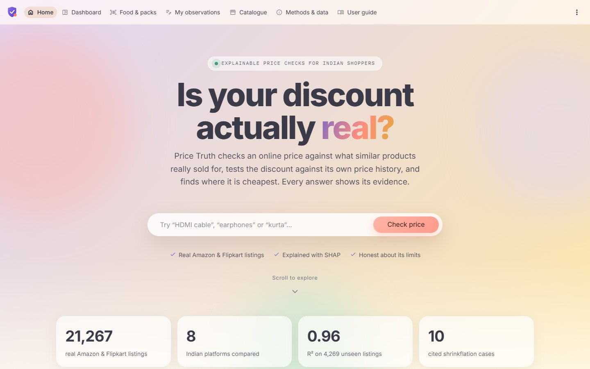

</div>

---

## Contents

1. [The problem](#-the-problem)
2. [What Price Truth does](#-what-price-truth-does)
3. [A tour of the app](#-a-tour-of-the-app)
4. [How it works](#-how-it-works)
5. [Model results](#-model-results)
6. [The data, honestly](#-the-data-honestly)
7. [Architecture](#-architecture)
8. [Tech stack and why](#-tech-stack-and-why)
9. [Testing and code quality](#-testing-and-code-quality)
10. [Non-functional requirements](#-non-functional-requirements)
11. [Run it yourself](#-run-it-yourself)
12. [Deployment and automation](#-deployment-and-automation)
13. [Limitations](#-limitations)
14. [Documentation map](#-documentation-map)
15. [Author](#-author)

---

## 🧩 The problem

Indian e-commerce is a ₹7.8 lakh crore market with more than 300 million online shoppers, and two pricing tricks are common:

| Trick | What happens | Why shoppers miss it |
|---|---|---|
| **The inflated "before" price** | A ₹2,500 product is listed with an MRP of ₹5,000 and sold as "50% off" | The MRP is set by the seller; nothing shows what the product *usually* sells for |
| **Shrinkflation** | A pack shrinks (e.g. 155 g → 135 g) while the price stays at ₹10 | The price tag does not change; India has no mandatory unit-price label like the UK or EU |

Existing tools solve parts of this: price trackers (CamelCamelCamel, Keepa) show history for one store, comparison sites (PriceBaba) list prices, and grocery apps show unit prices for their own stock. None tells an Indian shopper, in plain language and with reasons, **whether a specific price and discount are honest**.

## 💡 What Price Truth does

One scrolling dashboard answers six questions for any product in the catalogue:

| Question | How Price Truth answers it |
|---|---|
| **Is this a fair price?** | A gradient-boosting model estimates the usual price from 21,267 real listings, gives a 90% range, and explains each factor with SHAP |
| **Is the discount genuine?** | The EU 30-day reference-price rule compares the "sale" price with the lowest price of the previous 30 days; a classifier gives a second opinion |
| **How has the price moved?** | A 180-day price chart with sale events shaded and your price marked |
| **Is now a good time to buy?** | Where today's price sits in its 90-day range, the next sale on the calendar, and a forecast that is only shown when it beats "same as today" |
| **Where is it cheapest?** | Total cost on 8 Indian platforms, including delivery thresholds and platform fees |
| **Which pack is better value, and has it shrunk?** | Unit-price comparison, plus 10 cited Indian shrinkflation cases |

Results can be exported as a **PDF report, JSON or CSV**.

## 🖥️ A tour of the app

### The dashboard

Choose **Platform → Category → Subcategory → Product**, enter the MRP and the price you see, and every card updates. Six headline cards summarise the result; hovering any card explains how its number is produced.

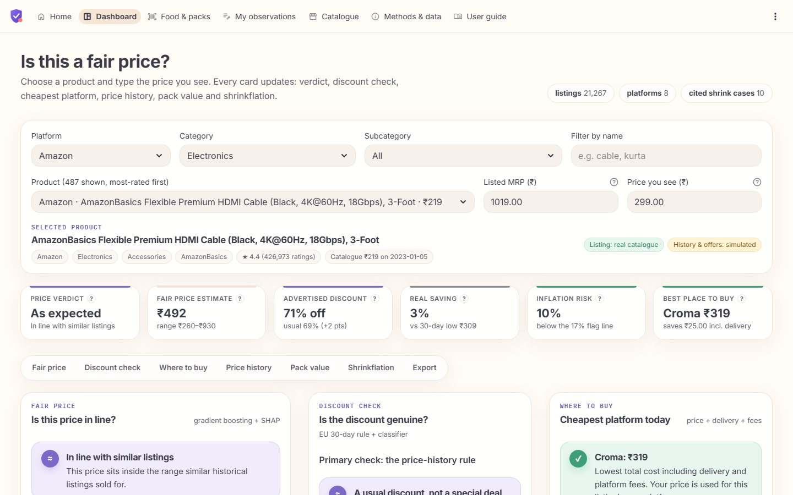

### Fair price and discount check

<table>
<tr>
<td width="55%" valign="top">

**Fair price.** Where your price sits in the expected range, and the factors that moved the estimate. The SHAP values are converted into percentages that add up from a typical listing to the estimate, so the explanation is readable without any ML knowledge.

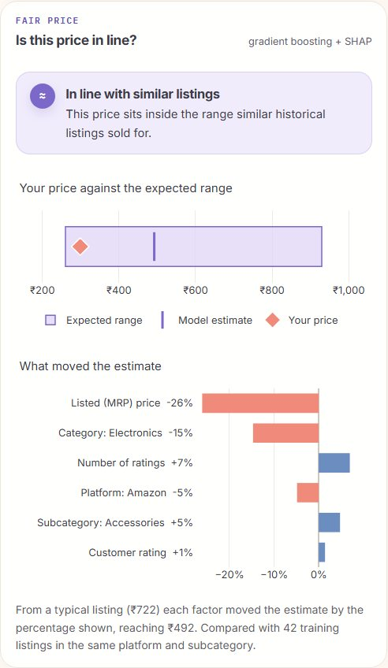

</td>
<td width="45%" valign="top">

**Discount check.** The primary check is the 30-day rule on the price history. The secondary check is a classifier that estimates the risk that the discount is inflated, with the factors that raised or lowered it.

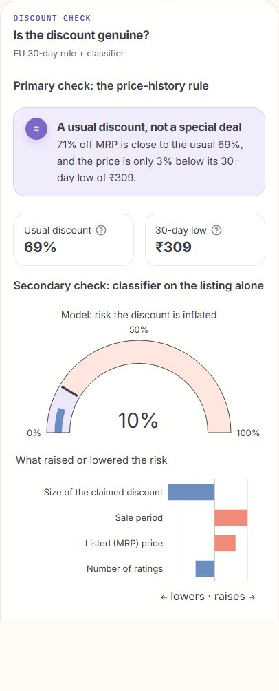

</td>
</tr>
</table>

### Price history, where to buy, and shrinkflation

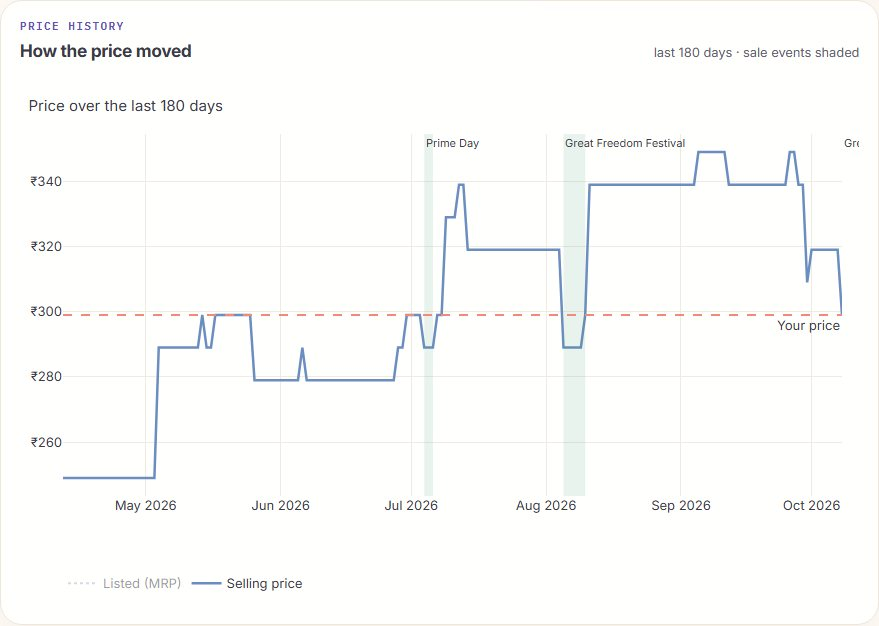

<table>
<tr>
<td width="50%" valign="top">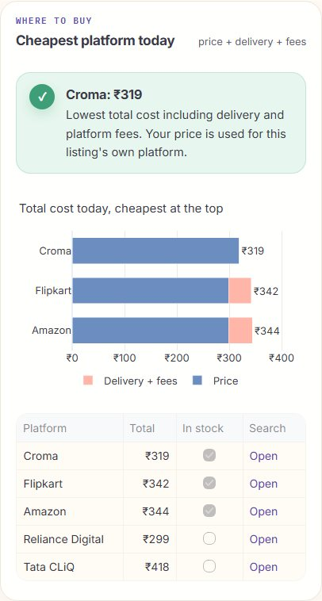</td>
<td width="50%" valign="top">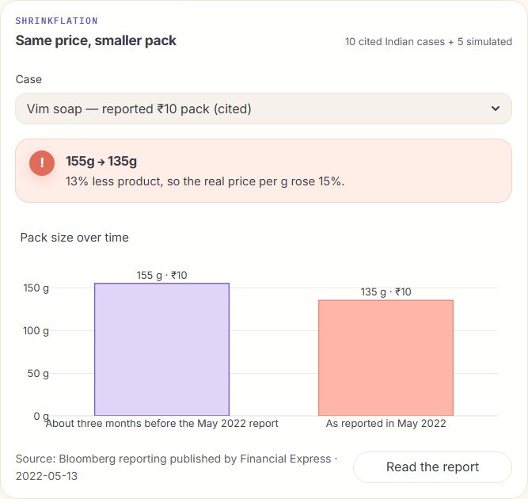</td>
</tr>
<tr>
<td width="50%" valign="top">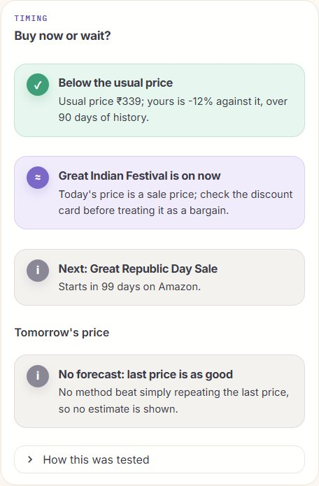</td>
<td width="50%" valign="top">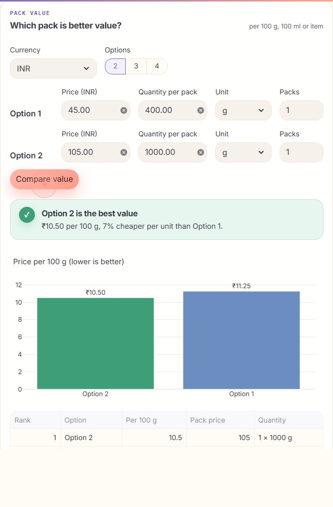</td>
</tr>
</table>

### Other pages

| Page | What it does |
|---|---|
| **Home** | Landing page with a product search, live coverage figures and a card for each feature |
| **Dashboard** | The product check shown above |
| **Food & packs** | Barcode or name lookup in Open Food Facts (live, with a saved fallback), real Open Prices shop history, and a pack-size hand-off to the dashboard |
| **My observations** | Record prices by hand or import a CSV: price history, gated forecast, store comparison and pack-size changes |
| **Catalogue** | Search and export the Amazon and Flipkart catalogues |
| **Methods & data** | Model accuracy by category, which data is real and which is simulated, sources, licences and limits |
| **User guide** | An illustrated guide, also available as a download |

<table>
<tr>
<td width="70%" valign="top">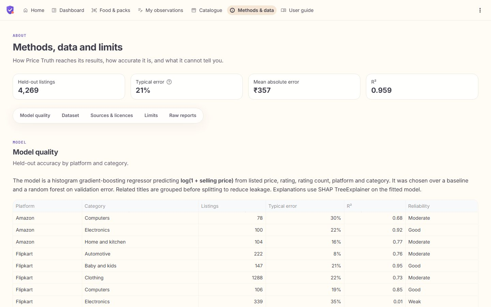</td>
<td width="30%" valign="top">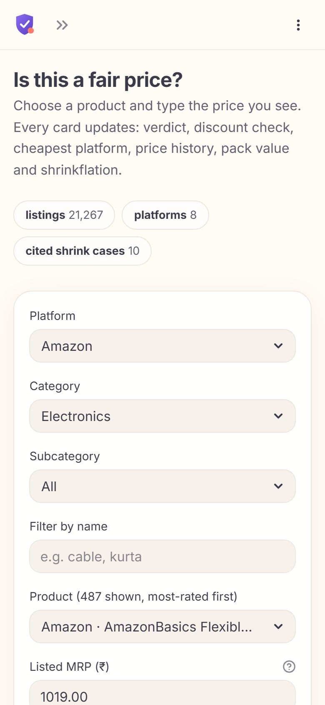</td>
</tr>
</table>

The layout works on desktop, tablet and phone (tested at 390, 768 and 1440 px with no horizontal overflow).

## ⚙️ How it works

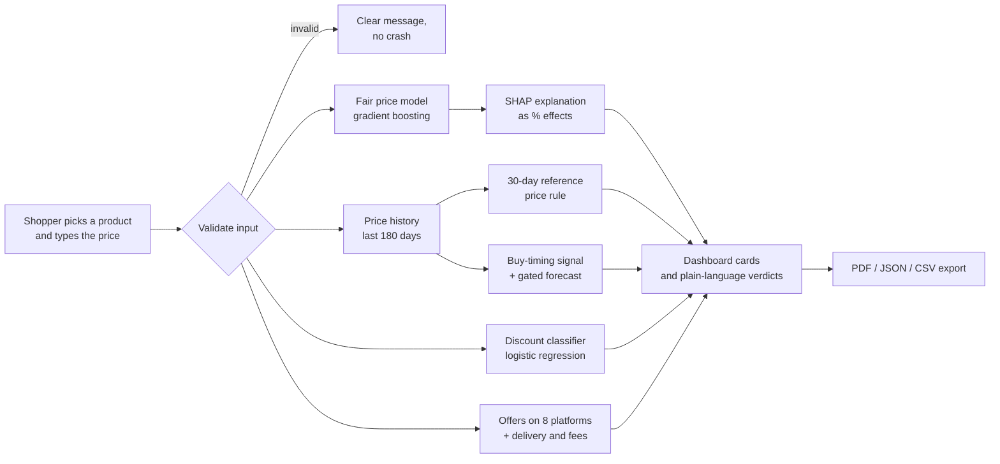

**1. Fair price (regression).** A scikit-learn `HistGradientBoostingRegressor` predicts `log(1 + price)` from platform, category, subcategory, brand, MRP, rating and number of ratings. Training uses grouped splits so near-identical titles never appear in both training and test data. A calibrated residual radius (conformal-style) turns the estimate into a 90% range, and the verdict compares your price with that range. A verdict is only given when at least 30 similar training listings exist; otherwise the app falls back to a broader group and says so.

**2. Explanation (SHAP).** `TreeExplainer` gives exact additive contributions for each factor. The dashboard converts them into percentage effects ("Listed MRP −26%") that multiply up from a typical listing to the estimate.

**3. Discount check (rule + classifier).** The primary check follows the EU Omnibus Directive (2019/2161, Art. 6a): a discount should be measured against the lowest price of the previous 30 days, not against the MRP. A logistic-regression classifier, trained on calibrated labels, gives a secondary risk score with its own factor chart.

**4. Timing and forecast.** The app shows where today's price sits in its 90-day range and the upcoming sale calendar (Prime Day, Great Freedom Festival, Big Billion Days, Great Indian Festival). A next-day forecast is only displayed when it beats the naive "same as today" forecast on held-out days. When it doesn't, the app says so rather than guessing.

**5. Where to buy and pack value.** Total cost per platform includes delivery thresholds and platform fees. Unit prices normalise packs to price per 100 g, 100 ml or unit.

## 📊 Model results

Evaluated on **4,269 real listings the model never saw** during training:

| Metric | Gradient boosting (chosen) | Median baseline |
|---|---|---|
| R² | **0.959** | 0.958 |
| Mean absolute error | **₹357** | ₹373 |
| Median error | **20.8%** | 23.4% |
| 90% range actually covering the true price | **89.8%** | — |

The model was chosen on the validation set by the lowest mean absolute log error (0.259 against 0.264 for a random forest and 0.279 for the baseline). Because prices span from ₹35 to over ₹5 lakh, R² is high for every model; the median percentage error is the more honest measure of a typical prediction. Accuracy by category is shown in the app, and the weakest group (Flipkart Electronics) carries a warning.

**Discount classifier:** logistic regression, ROC AUC **0.88**, chosen over gradient boosting on average precision (0.267 against 0.227) and better calibration (Brier 0.049 against 0.054). It is a secondary check because its labels are simulated.

## 🗂️ The data, honestly

| Layer | Source | Size | Used for |
|---|---|---|---|
| **Real listings** | Amazon India (crawled 5 Jan 2023, CC BY-NC-SA 4.0) and Flipkart (2015–16, CC BY-SA 4.0) from Kaggle | **21,267** cleaned listings, 15 category groups | Training and evaluating the price model, the catalogue |
| **Real food data** | Open Food Facts and Open Prices (ODbL) | Live API with saved responses | Food & packs page, real shop price history |
| **Real shrinkflation cases** | News reports, each cited with a link | 10 Indian cases | Shrinkflation section |
| **Simulated layers** | Seeded generator calibrated to published Indian research, adjusted for inflation with official MoSPI CPI data | Daily histories, discount labels, offers on 8 platforms | History, discount check, timing, where to buy |

Rules the project keeps:

- **The price model trains and evaluates on real listings only.**
- Every row carries a `provenance` column (`real` or `synthetic`), and every generator parameter and its source is listed in [`datasets/final/assumptions.json`](datasets/final/assumptions.json).
- The app labels simulated content ("History & offers: simulated"), and exports state it too.
- The raw Kaggle files are never modified; tests check their SHA-256 hashes.
- Shrinkflation timelines for real brands are only shown when cited; simulated timelines use generic names.

Full details: [dataset card](datasets/final/DATA-CARD.md) · [data sources](docs/DATA-SOURCES.md).

## 🏗️ Architecture

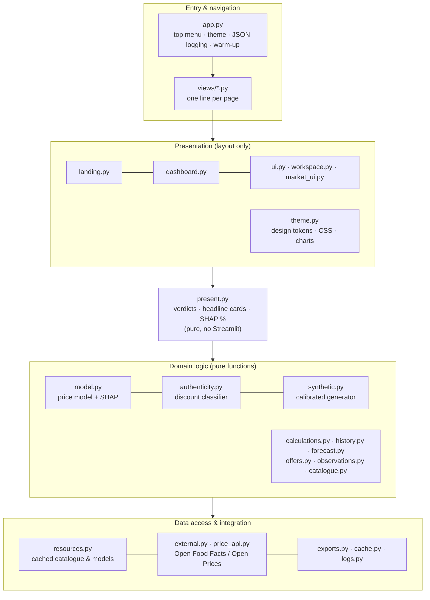

**Pages never compute business numbers**; they call the domain modules, which are pure functions over pandas data and raise readable `ValueError`s for bad input. This keeps the logic unit-testable and the mutation testing meaningful.

```text
app.py                 navigation, theme, logging, warm-up
views/                 one file per page
src/price_truth/       the package (landing, dashboard, domain, data access)
scripts/               review, audits, dataset build, browser / load / uptime checks
tests/                 PyTest + Streamlit AppTest (UI tests run offline)
datasets/              raw CSVs (never modified), processed catalogue, external API data, final/
reports/               live model outputs; reports/current/ holds review evidence
docs/                  architecture, data sources, user guide, mutation survivors
.github/workflows/     CI, daily price collection, uptime probe
```

More detail, including module boundaries and design decisions: [docs/ARCHITECTURE.md](docs/ARCHITECTURE.md).

## 🧰 Tech stack and why

| Need | Chosen | Considered | Why |
|---|---|---|---|
| Web app | **Streamlit 1.57** | Flask/FastAPI + React, Dash, Django | One language with the models, built-in caching and session state, an official UI test harness, free HTTPS hosting |
| Price model | **scikit-learn HistGradientBoosting** | Random forest, XGBoost/LightGBM, median baseline | Best validation error, handles missing ratings natively, no extra compiled dependency |
| Explanation | **SHAP TreeExplainer** | LIME, permutation importance | Exact, additive, per-prediction values for tree models |
| Discount model | **Logistic regression** | Gradient-boosting classifier | Higher average precision, better calibrated, self-explaining coefficients |
| Charts | **Plotly** | Altair, Matplotlib | Interactive hover tooltips |
| PDF export | **ReportLab** | WeasyPrint, fpdf2 | Pure Python, works on Community Cloud and in the slim Docker image |
| Tests | **pytest + AppTest + Playwright** | unittest, Selenium | AppTest runs real pages offline; Playwright drives Chromium, Firefox and WebKit and runs load tests |
| Quality | **Ruff, Radon, mutmut, Bandit, pytest-cov** | flake8, lizard, cosmic-ray, Semgrep | Fast, standard, scriptable, JSON output for the review |
| Hosting | **Streamlit Community Cloud + Dockerfile** | Render, Hugging Face Spaces | Free HTTPS, redeploys on every push; Docker keeps other hosts open |

## ✅ Testing and code quality

Measured on the final code by the CI review (evidence in [`reports/current/`](reports/current/)):

| Check | Result |
|---|---|
| **Tests** | **420 passing**, no warnings |
| **Coverage** | **95.05%** statements, **87.21%** branches |
| **Mutation testing** (8 domain modules) | **1,556 / 1,582** mutants killed (**98.36%**); the 26 survivors are justified as equivalent in [docs/MUTATION-SURVIVORS.md](docs/MUTATION-SURVIVORS.md) |
| **Lint** | Ruff: 0 issues |
| **Complexity** | Every function Radon rank **A or B** |
| **Security (SAST)** | Bandit: **0 findings** |
| **Browsers** | Chromium, Firefox and WebKit: landing search, dashboard, PDF download, pack compare and food flows pass, locally and on the live site |
| **Dataset audit** | **59 / 59** integrity checks pass |

How the testing is organised:

- **Unit and domain tests** for every calculation, with edge cases (zero, negative and missing prices, empty histories).
- **Regression tests**: every bug found in code review has a test written first ([`tests/test_review_fixes*.py`](tests/)).
- **UI tests** with Streamlit `AppTest` run the real pages offline in CI.
- **Mutation testing** checks that the tests actually catch changes in the domain logic, not just run it.
- **Browser and load tests** with Playwright run against the deployed app.
- **Every push** runs the whole review, builds and health-checks the Docker image, and runs the browser flows.

## 📐 Non-functional requirements

| NFR | How it is met | Evidence |
|---|---|---|
| **Performance** | Catalogue and models load once; a background warm-up prepares SHAP and PDF; results are cached per quote | Assessment after warm-up: p95 **0.06 s**; first assessment 0.37 s |
| **Scalability** | Stateless server with shared cached models; scales by container replicas | Live site served **10/10** and **25/25** simultaneous real-browser users with no errors |
| **Security** | No secrets needed; every input validated; CSV uploads size- and schema-checked; HTML escaped; links allow-listed; non-root Docker image | Bandit 0 findings; validation tests |
| **Reliability & logging** | Structured JSON logs; API failures fall back to labelled saved responses; health endpoint; 15-minute uptime probe | `tests/test_logs.py`, `uptime.yml` |
| **Maintainability** | Layered modules, rank A/B functions, docstrings, regression tests | Radon reports, coverage and mutation results |
| **Usability & accessibility** | Plain-language verdicts that don't rely on colour, hover and keyboard-focus explanations, reduced-motion support | axe-core finds no serious issue in the app's own markup |
| **Portability** | Windows, macOS, Linux; Docker image built in CI | `.gitattributes`, `checks.yml` |
| **Privacy** | No accounts, no personal data stored; observations live only in the session | Design |

## 🚀 Run it yourself

The repository already contains the cleaned catalogue, trained models, simulated layers and saved API responses, so the app runs without downloading any data.

**Requirements:** Python 3.12.

```bash
git clone https://github.com/Swagata-Bhowmik/PriceTruth.git
cd PriceTruth
python -m venv .venv
```

macOS / Linux:

```bash
.venv/bin/python -m pip install -r requirements.lock -r requirements-dev.txt
.venv/bin/python -m streamlit run app.py
```

Windows:

```bash
.venv\Scripts\python.exe -m pip install -r requirements-dev.txt
.venv\Scripts\python.exe -m streamlit run app.py
```

Open **http://localhost:8501**. Live food search needs internet; switch on *Saved responses only* to work offline. (`requirements.lock` is resolved for Linux; on Windows install from `requirements-dev.txt`.)

<details>
<summary><b>Quality checks</b></summary>

```bash
.venv/bin/python -m pytest -q                         # all tests (UI tests run offline)
.venv/bin/ruff check .                                # lint
.venv/bin/radon cc -s -n C src scripts app.py views   # prints nothing when every function is rank A/B
.venv/bin/python scripts/review.py                    # full review → reports/current/ (Linux/WSL; includes mutmut)
```

With the app running (`PRICE_TRUTH_URL` selects the host):

```bash
.venv/bin/python scripts/browser_current.py --browser chrome   # also firefox, webkit
.venv/bin/python scripts/load_test.py --users 10 25            # concurrent real browsers
```

</details>

<details>
<summary><b>Rebuilding data and models</b> (only when the data changes)</summary>

```bash
.venv/bin/python -m price_truth.data               # raw CSVs → datasets/processed/catalogue.csv
.venv/bin/python -m price_truth.model              # retrain the price model (real listings only)
.venv/bin/python scripts/model_audit.py            # per-category accuracy
.venv/bin/python scripts/build_final_dataset.py    # simulated layers + discount model → datasets/final/
```

</details>

<details>
<summary><b>Docker</b></summary>

```bash
docker build -t price-truth .
docker run --rm -p 8501:8501 price-truth
```

The image runs as a non-root user and is built and health-checked on every push.

</details>

## ☁️ Deployment and automation

The app is hosted on **Streamlit Community Cloud** at **https://pricetruth.streamlit.app**, deployed from the `main` branch with `app.py` and Python 3.12. Every push redeploys it.

| Workflow | When | What it does |
|---|---|---|
| [`checks.yml`](.github/workflows/checks.yml) | Every push | Full review (Ruff, PyTest + coverage, Radon, Bandit, mutmut, source-hash manifest), Docker build and health check, browser flows in three engines |
| [`collect-prices.yml`](.github/workflows/collect-prices.yml) | Daily, 08:00 IST | Collects a bounded Open Prices INR snapshot, archived only when it changes |
| [`uptime.yml`](.github/workflows/uptime.yml) | Every 15 minutes | Probes the live app's health endpoint |

## ⚠️ Limitations

Price Truth is honest about what it cannot do:

- **The real listings are snapshots** (Amazon 2023, Flipkart 2015–16), not live prices; no website is scraped.
- **Price histories, discount labels and platform offers are simulated**, calibrated to published research and clearly labelled. The discount classifier is therefore a secondary check.
- **Accuracy varies by category**; Flipkart Electronics is weak and is flagged in the app.
- **The forecast often declines to predict**, by design, because it only shows when it beats a naive baseline.
- **The free hosting tier is a single small instance**; it was load-tested with 25 simultaneous users, not hundreds.
- **Observations you record are kept only for the session** unless you download them.

## 📚 Documentation map

| Document | What it covers |
|---|---|
| [User guide](docs/USER-GUIDE.html) | Illustrated walkthrough of every page (also inside the app at `/user-guide`) |
| [Architecture](docs/ARCHITECTURE.md) | Layers, data flow, framework trade-offs, how each NFR is met |
| [Dataset card](datasets/final/DATA-CARD.md) | Every dataset layer, its provenance and assumptions |
| [Data sources](docs/DATA-SOURCES.md) | Sources, licences and attribution |
| [Code review report](reports/current/CODE-REVIEW-REPORT.md) | Current measured quality, with raw evidence alongside |
| [Mutation survivors](docs/MUTATION-SURVIVORS.md) | Why each surviving mutant is equivalent |
| [Usability study](docs/USABILITY-STUDY.md) | Usability study kit |
| [Project status](PROJECT-COMPLETION.md) | Measured state, decisions and open items |

## 👩‍💻 Author

**Swagata Bhowmik** · [GitHub](https://github.com/Swagata-Bhowmik)

Under the guidance of **Prof. (Dr.) Yogesh Naik**.

### Licence and attribution

Data: Amazon India dataset (CC BY-NC-SA 4.0), Flipkart dataset (CC BY-SA 4.0), Open Food Facts and Open Prices (ODbL). Use is non-commercial, with attribution, as shown on the Methods & data page.

<div align="center">

<sub>Made to make e-commerce prices honest. 🛡️</sub>

</div>
